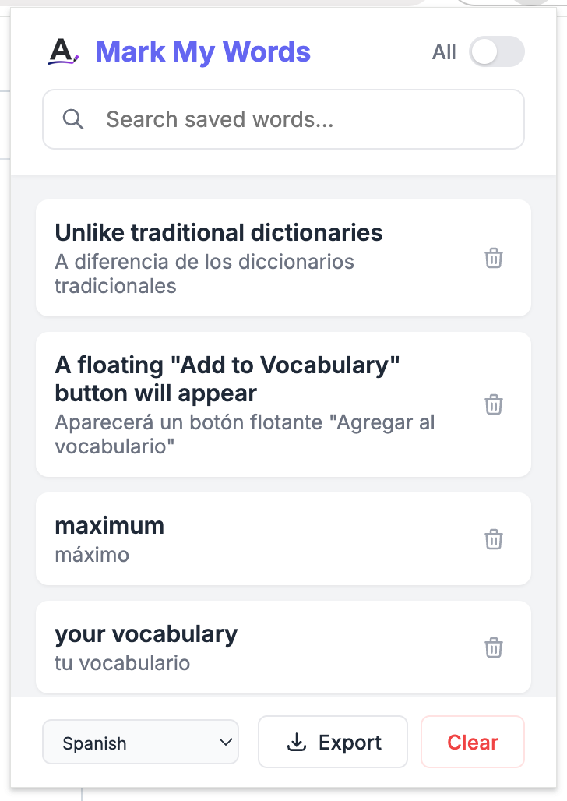

# Mark My Words


## ✨ Features

-   **Contextual Highlighting**: Select any text to translate and save it. The extension automatically highlights this word on the current page and any future pages you visit.
-   **Inline Translation**: View translations instantly by hovering over highlighted words.
-   **Smart Management**:
    -   **Edit**: Click the translation label to modify it instantly.
    -   **Delete**: Click the highlighted word to remove it. Changes sync immediately across the page.
-   **Filtering**: Toggle between viewing words saved on the **Current Page** or your **Entire History**.
-   **Source Linking**: When viewing "All Words", click the link to jump back to the exact page where you originally saved the word.
-   **Export**: Export your vocabulary list to CSV for study in Anki or Excel.
-   **Privacy Focused**: All data is stored locally in your browser (`chrome.storage.local`).

## 🚀 Installation

### From Source (Developer Mode)

1.  Clone this repository:
    ```bash
    git clone https://github.com/yourusername/mark-my-words.git
    ```
2.  Open Chrome and navigate to `chrome://extensions/`.
3.  Enable **Developer mode** in the top right corner.
4.  Click **Load unpacked**.
5.  Select the directory where you cloned the repository.

## 📖 Usage

1.  **Select & Save**: Highlight any text on a webpage. A floating "Add to Vocabulary" button will appear. Click it to translate and save.
2.  **Review**: Click the extension icon to view your list.
    -   Use the **Toggle Switch** to filter between "Current Page" and "All".
    -   Use the **Export** button to download your list.
3.  **Edit/Delete**: Interactive highlights allow you to manage your vocabulary directly on the web page.

## 🛠 Local Development

The project is built with vanilla HTML/CSS/JS for maximum performance and zero dependencies.

### Structure

-   `manifest.json`: Extension configuration (Manifest V3).
-   `scripts/content.js`: Handles text selection, highlighting, and DOM manipulation.
-   `scripts/background.js`: Manages context menus and translation API calls.
-   `popup/`: Contains the UI for the browser action popup.
-   `styles.css`: Shared styles for content injection.

### Building

No build step is required! Just edit the files and click the **Refresh** icon on the extension card in `chrome://extensions/` to see changes.

## 🤝 Contributing

Contributions are welcome! Please feel free to submit a Pull Request.

## 📄 License

This project is licensed under the MIT License - see the [LICENSE](LICENSE) file for details.
